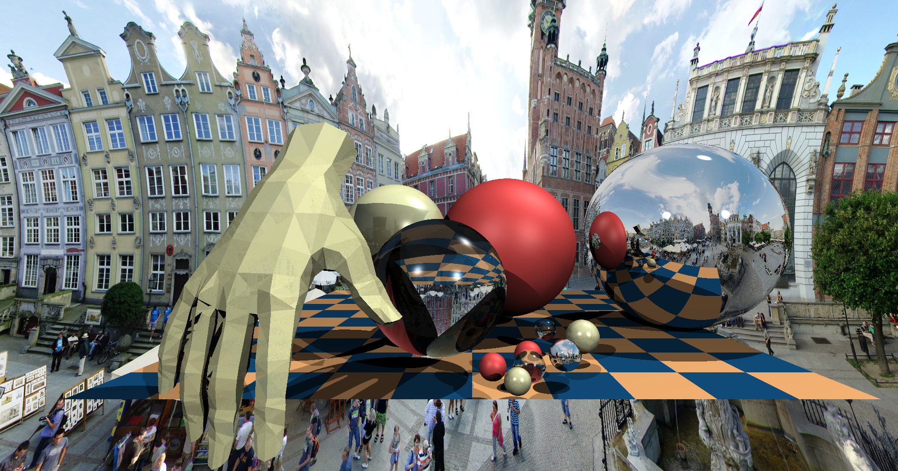

## Simple Raytracer in C++ from Scratch

This project is a basic raytracer implemented in C++ without relying on any external libraries.     

### Features
- Rendering of spheres, planes, and triangles.
- Support for loading and rendering 3D models.

### Screenshots


### How to Use
1. Clone the repository.
2. Open Visual Studio Developer Command Prompt or Visual Studio Developer PowerShell.
3. Navigate to the project directory using the command prompt or PowerShell.
4. Open the project in Visual Studio Code by typing the following command:

    ```
    code project-name
    ```
5. Once the project is open in Visual Studio Code, you can build and run it.


### Future Improvements
- Addition of more geometric primitives.
- Optimization for faster rendering.
- Implementation of advanced rendering techniques.

### License
This project is licensed under the [MIT License](LICENSE). Feel free to use and modify it for your own projects.


### Acknowledgments

This project draws inspiration from various sources:

- **"Graphics From Scratch"** book by Gabriel Gambetta, which provided valuable insights into the fundamentals of computer graphics.

- **TinyRaytracer** by ssloy (https://github.com/ssloy/tinyraytracer), a compact raytracer project, served as a reference for building a minimalistic yet functional raytracer.

- **ScratchPixel** (https://www.scratchapixel.com/), particularly the tutorial on "Ray-Tracing: Rendering a Triangle" (https://www.scratchapixel.com/lessons/3d-basic-rendering/ray-tracing-rendering-a-triangle/ray-triangle-intersection-geometric-solution), offered detailed explanations and algorithms for rendering geometric primitives.

Special thanks to these resources for their invaluable contributions to the development of this project.


### Author
[Rahul Sinha] - [-] - [-]